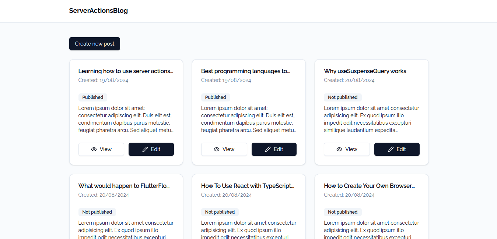
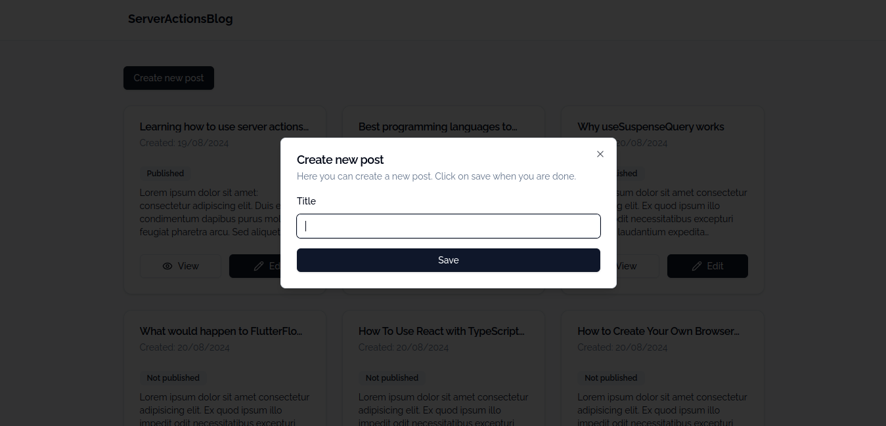
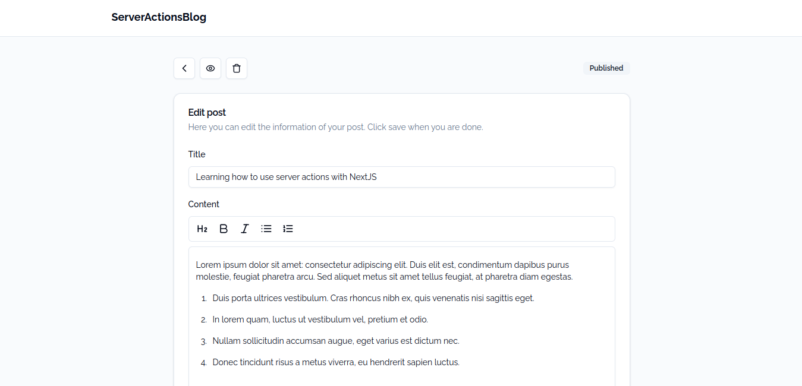
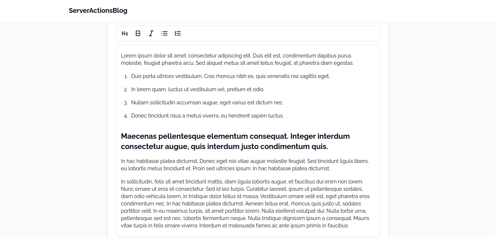
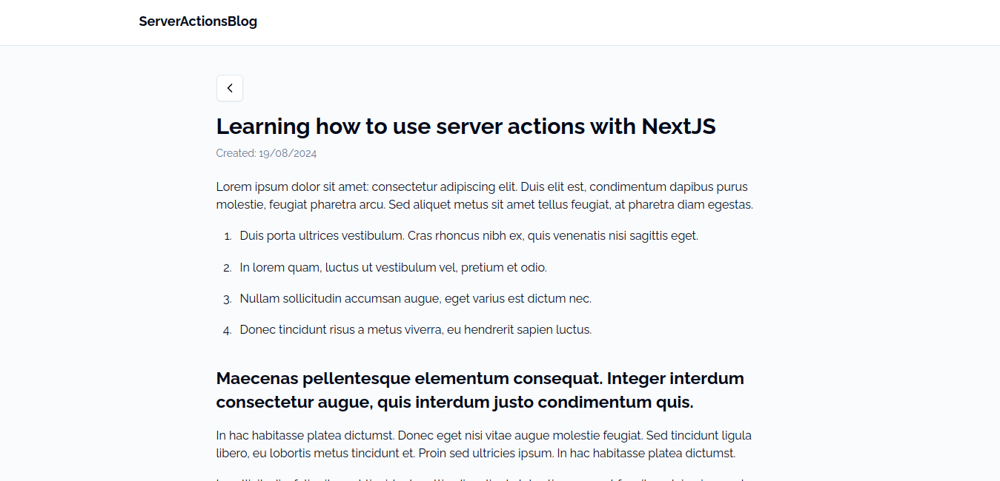

# Server actions CRUD with NextJS - Blog

This is a blog style app that I developed using NextJS and making use of Sever Actions. For data management and a cleaner development structure, I used the hexagonal architecture following the pattern of Infrastructure, Applications and Domain.

Technologies used for the development of the project:

- NextJS
- TailwindCSS
- ShadcnUI
- SQLite
- Tiptap (Rich text editor component)

To run the project do the following. Don't worry about the database, the project has already integrated a small database made in SQLite:

1. Clone the repository
```Shell
$ git clone https://github.com/Remy349/server-actions-crud-blog.git
```

2. Install dependencies
```Shell
$ npm install
```

3. Execute the project
```Shell
$ npm run dev
```

## Final result of the project






